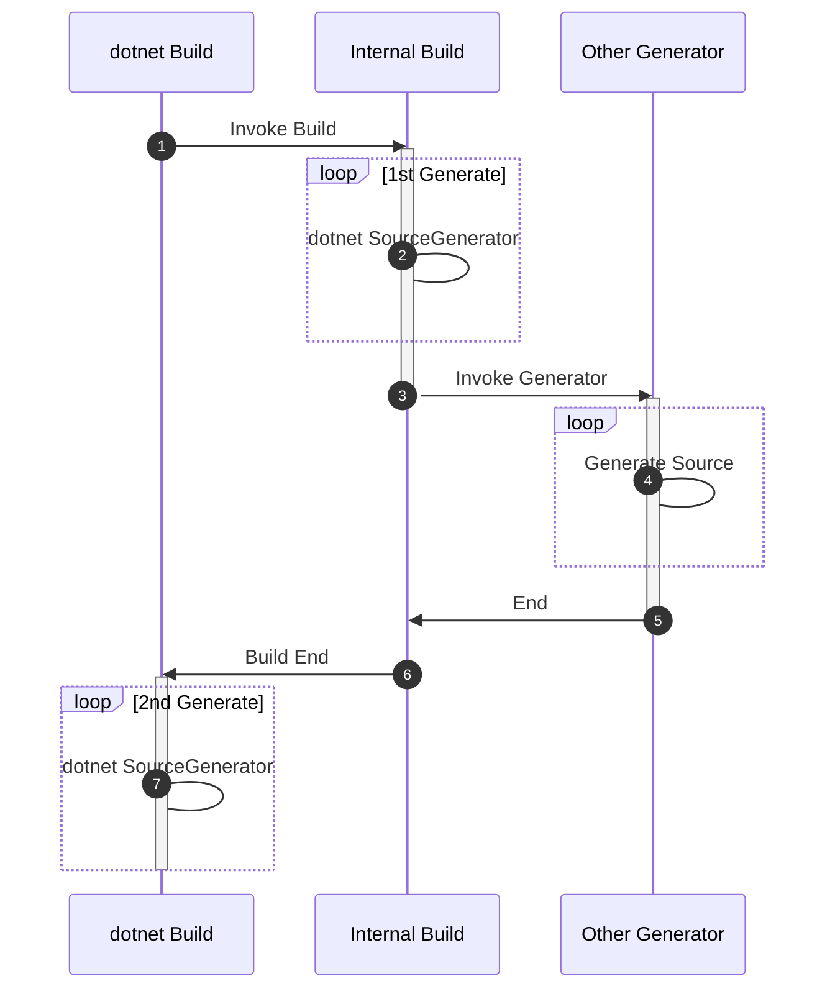

# HarmonicGenerator

Integrate the C# Source Generator with other source generators.

# Architecture

```mermaid
sequenceDiagram
  participant Build as dotnet Build
  participant Inner as Internal Build
  participant Other as Other Generator
  autonumber
  Build->>Inner: Invoke Build
  activate Inner
  loop 1st Generate
    Inner->Inner: dotnet SourceGenerator
  end
  Inner->>Other: Invoke Generator
  deactivate Inner
  activate Other
  loop
    Other->Other: Generate Source
  end
  Other->>Inner: End
  deactivate Other
  Inner->>Build: Build End
  activate Build
  loop 2nd Generate
    Build->Build: dotnet SourceGenerator
  end
  deactivate Build
```
